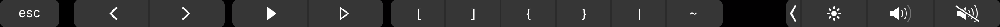

# dev-touch-bar README

This is a visual studio code extension in order to add keys mostly used by developers but not easily accessible on some non US Mac keyboards.

## Features

Add brackets, brace, pipe, and tilde keystrokes to touchbar.

See screenshot 



## Requirements

This extension only works with a MacBook featuring touch bar.

The app bar must be large enough to hold the 6 keys ie the global right control strip must not contain
more than 3 commands.

## Installation 

Download [source code bundle](https://gitlab.com/nicolas800/dev-touch-bar/-/archive/master/dev-touch-bar-master.zip) from gitlab, unzip it and then copy the directory content to ~/.vscode/extensions

## Rebuild 

If you need to change its behavior.

```
npm run compile
```
